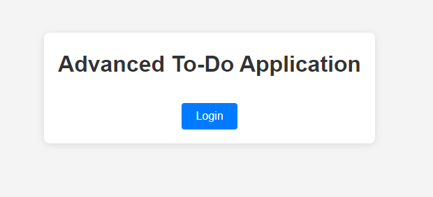
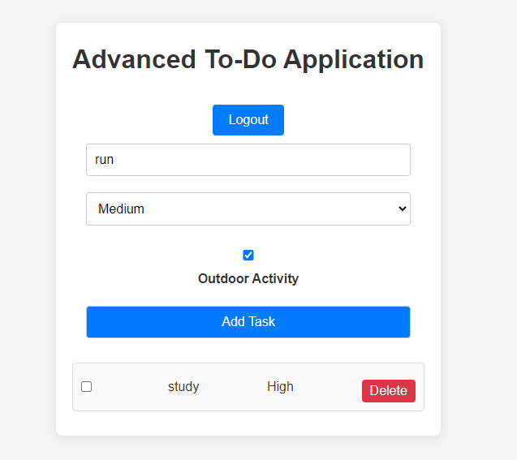
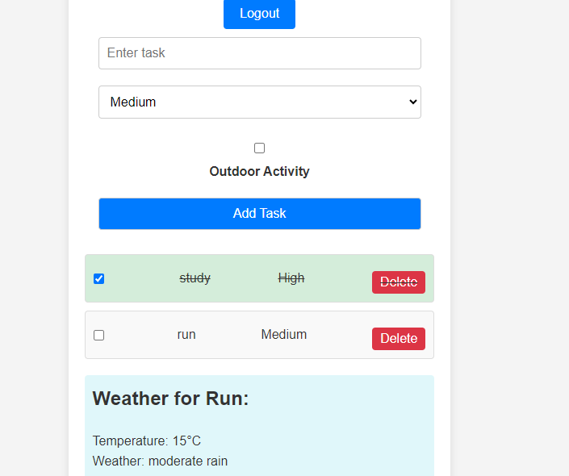

# Advanced To-Do Application

This project is an advanced to-do application built with React and Vite. It includes features such as task management, weather information for outdoor tasks, and authentication. This README provides an overview of the project, its features, setup instructions, and deployment details.

## Live Demo

Check out the live demo of the Currency Converter 
https://to-do-reduxt.netlify.app

## Overview

Here are some screenshots of my project:






## Features

- **Task Management:** Add, delete, and manage tasks with different priorities.
- **Weather Integration:** Fetch and display weather information for outdoor tasks.
- **Authentication:** Basic authentication implementation.
- **Responsive Design:** Built with Vite and React, ensuring a smooth user experience.

## Project Setup

To set up and run this project locally, follow these steps:

### Prerequisites

Make sure you have the following installed:

- [Node.js](https://nodejs.org/) (version 16.x or higher)
- [Git](https://git-scm.com/) (for version control)


1. **Clone the Repository:**

   Open your terminal and run the following command to clone the repository:

   ```bash
   git clone https://github.com/MdDanish11/todo-redux.git

2. **Navigate to the Project Directory:**

   Change your directory to the cloned project:

   ```bash
   cd todo-redux
   
## Installing Dependencies

1. **Install Project Dependencies:**

   Install the required dependencies using npm (or yarn):

   ```bash
   npm install
2. **Add Your API Key:**

   VITE_API_KEY=YOUR_API_KEY

## Running the Development Server

   1. **Start the Development Server:**

      Use npm to start the development server:

   2. **Open the Application in Your Browser:**

      After starting the server, open your browser and go to http://localhost:3000 to view the application.

## Project structure

- 

